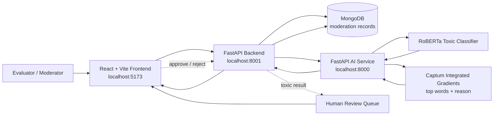

# Content Moderation Platform

A full-stack content moderation system that accepts user text, classifies it as toxic or safe, explains why toxic content was flagged, and sends flagged content to a human review queue.

## Features

- Text moderation API with toxicity score, labels, severity, and explanation
- Human review queue for flagged content
- Approve/reject workflow for moderators
- Moderation statistics dashboard
- React frontend, FastAPI backend, FastAPI AI service, and MongoDB
- Docker Compose setup for local evaluation

## Tech Stack

| Layer | Technology |
| --- | --- |
| Frontend | React, Vite |
| Backend API | FastAPI, Motor, MongoDB |
| AI Service | FastAPI, PyTorch Lightning, Transformers, Captum |
| Model | RoBERTa-based toxic comment classifier |
| Database | MongoDB |
| Containerization | Docker, Docker Compose |

## Dataset

The model was trained and tested using toxic-comment data from the Jigsaw Toxic Comment Classification dataset:

https://www.kaggle.com/datasets/julian3833/jigsaw-toxic-comment-classification-challenge

For assignment evaluation, use 5000 samples for testing. The current implementation uses a RoBERTa-based classifier with these labels:

- toxic
- severe_toxic
- obscene
- threat
- insult
- identity_attack

## Project Structure

```text
content-moderation-platform/
  ai-service/       FastAPI ML inference and explainability service
  backend/          FastAPI API, MongoDB persistence, review queue
  frontend/         React + Vite moderation console
  docker-compose.yml
  start-services.ps1
  README.md
```

## Environment Setup

No secrets are committed. Copy the example environment files before running locally:

```powershell
Copy-Item backend\.env.example backend\.env
Copy-Item ai-service\.env.example ai-service\.env
```

Backend example:

```env
MONGO_URL=mongodb://localhost:27017
DATABASE_NAME=content_moderation_db
AI_SERVICE_URL=http://127.0.0.1:8000
PORT=8001
```

AI service example:

```env
MODEL_PATH=app/models/best_model_v2.ckpt
MODEL_NAME=roberta-base
MAX_LEN=128
```

## Run With Docker

Use one command from the repository root:

```powershell
docker-compose up --build
```

Services:

| Service | URL |
| --- | --- |
| Frontend | http://localhost:5173 |
| Backend API | http://localhost:8001 |
| AI Service | http://localhost:8000 |
| MongoDB | Internal Docker network as `mongo:27017` |

The first AI service startup can take a few minutes because Python ML dependencies are installed and the RoBERTa checkpoint is loaded.

## Run Manually

Start MongoDB locally first.

AI service:

```powershell
cd ai-service
python -m venv .venv
.\.venv\Scripts\Activate.ps1
pip install -r requirements.txt
python -m uvicorn app.main:app --host 127.0.0.1 --port 8000
```

Backend:

```powershell
cd backend
python -m venv .venv
.\.venv\Scripts\Activate.ps1
pip install -r requirements.txt
python -m uvicorn app.main:app --host 127.0.0.1 --port 8001
```

Frontend:

```powershell
cd frontend
npm install
npm run dev
```

Open:

```text
http://127.0.0.1:5173
```

There is also a local PowerShell launcher:

```powershell
.\start-services.ps1
```

## API Endpoints

| Method | Endpoint | Description |
| --- | --- | --- |
| POST | `/api/moderate` | Creates a moderation request, stores it as `PROCESSING`, then runs AI analysis in the background |
| POST | `/api/moderate/sync` | Runs moderation synchronously and returns the completed result |
| GET | `/api/moderate/{id}` | Gets one moderation record by id |
| GET | `/api/queue` | Lists items waiting for human review |
| POST | `/api/queue/{id}/decide` | Submits a human decision: `APPROVED` or `REJECTED` |
| GET | `/api/stats` | Returns moderation statistics |

Example request:

```powershell
Invoke-RestMethod `
  -Method Post `
  -Uri http://127.0.0.1:8001/api/moderate `
  -ContentType "application/json" `
  -Body '{"text":"You are awful and I hate you"}'
```

Example decision:

```powershell
Invoke-RestMethod `
  -Method Post `
  -Uri http://127.0.0.1:8001/api/queue/<moderation_id>/decide `
  -ContentType "application/json" `
  -Body '{"decision":"APPROVED"}'
```

## Demo Sample Inputs

Use these examples in the frontend to show the full flow:

| Text | Expected Flow |
| --- | --- |
| `Thanks for helping me today, I appreciate it.` | Safe, approved automatically |
| `You are disgusting and useless.` | Toxic, sent to review queue |
| `I will find you and hurt you.` | Toxic threat, sent to review queue |
| `This quoted message says "you are awful", but I am reporting it.` | Ambiguous; should be reviewed carefully |

## Architecture Diagram



## Data Flow

1. The user enters text in the frontend.
2. The frontend sends `POST /api/moderate` to the backend.
3. The backend stores the request in MongoDB with status `PROCESSING`.
4. The backend calls the AI service in the background.
5. The AI service tokenizes the text, runs the RoBERTa classifier, computes label scores, and uses Captum Integrated Gradients for explanations when content is toxic.
6. The backend updates MongoDB with the final result.
7. Safe content becomes `APPROVED`; toxic content becomes `PENDING_REVIEW`.
8. The review queue lets a human approve or reject flagged content.

## Part 2: Understanding Questions

### 1. How does the system decide if content is toxic?

The AI service uses a RoBERTa-based multi-label classifier. It tokenizes the submitted text, runs it through the model, applies sigmoid probabilities for each toxicity label, and treats the main `toxic` score as the primary decision score. If the toxic score is greater than `0.5`, the content is marked toxic. The service also returns per-label scores, triggered labels, severity, top contributing words, toxic phrases, and a plain-English reason.

### 2. Which is worse: flagging safe content or missing toxic content?

For a moderation system, missing toxic content is usually worse because harmful content can reach users and damage trust, safety, and legal compliance. However, false positives are also serious because they can unfairly silence users. This project handles that tradeoff by sending flagged items to human review instead of permanently rejecting them automatically.

### 3. How do you handle sarcasm, quoted content, and non-English?

Sarcasm is difficult because the literal words can be safe while the intent is harmful, or the reverse. The model score should be treated as a signal, not a final judgment, especially for ambiguous cases.

Quoted content should be handled with context. A user reporting abuse may quote toxic language without endorsing it. The safest product behavior is to keep the item explainable and route uncertain or high-risk content to human review.

Non-English content requires either a multilingual moderation model, language detection plus language-specific models, or translation before moderation. A model trained mainly on English should not be trusted as the only decision-maker for non-English text.

### 4. How might bad actors evade detection?

Bad actors may use misspellings, spacing, symbols, homoglyphs, coded language, emojis, screenshots of text, sarcasm, indirect threats, or language switching. They may also test the system repeatedly to learn the threshold. Defenses include text normalization, multilingual models, image OCR for screenshots, rate limiting, adversarial test sets, human review, and regular retraining with newly observed abuse patterns.

### 5. Give 2 examples where AI-generated code had security issues.

One example is AI-generated backend code that builds database queries directly from user input, causing SQL injection or NoSQL injection risk. The fix is to use parameterized queries, validation, and least-privilege database users.

Another example is AI-generated authentication code that disables JWT verification, hard-codes secrets, logs tokens, or accepts unsigned tokens for convenience during testing. The fix is to require verified signatures, use environment-managed secrets, avoid logging sensitive values, and add authentication tests.

## Explainability

For toxic content, the AI service uses Captum Integrated Gradients to identify influential tokens. The response includes:

- `labels`: probability for each toxicity category
- `triggered_labels`: labels above the threshold
- `top_words`: words that contributed most to the toxic prediction
- `toxic_phrases`: short phrases built from high-impact words
- `reason`: human-readable explanation
- `severity`: `SAFE`, `LOW`, `MEDIUM`, or `HIGH`

Safe content skips the slower Captum step and returns `Safe content detected.`

## Bug Fix Documentation

### Bug 1: `/api/moderate/sync` used `now` before assignment

Why it was wrong:

The synchronous moderation path created `created_at` and `updated_at` fields with a `now` variable that did not exist in that function. Calling `POST /api/moderate/sync` would raise a `NameError` after the AI service returned.

Corrected code:

```python
async def moderate_sync(self, text: str):
    # Create timestamps inside this function before using them in the document.
    now = datetime.utcnow()

    ai_result = await ai_service.moderate_text(text)

    moderation_data = {
        "text": ai_result["text"],
        "is_toxic": ai_result["is_toxic"],
        "confidence": ai_result["confidence"],
        "labels": ai_result["labels"],
        "triggered_labels": ai_result["triggered_labels"],
        "reason": ai_result["reason"],
        "severity": ai_result["severity"],
        "status": "PENDING_REVIEW" if ai_result["is_toxic"] else "APPROVED",
        "created_at": now,
        "updated_at": now,
        "error": None,
    }
```

Additional test case:

- Send `POST /api/moderate/sync` with safe text and verify the response has `created_at`, `updated_at`, and no server error.
- Send `POST /api/moderate/sync` with toxic text and verify the status becomes `PENDING_REVIEW`.

### Bug 2: Frontend default API URL pointed to the wrong backend port

Why it was wrong:

The backend Dockerfile and Docker Compose expose the backend on `8001`, but the frontend default URL used `http://127.0.0.1:5000`. A fresh frontend load would fail API calls unless the evaluator manually changed the backend URL.

Corrected code:

```javascript
// Match the backend port used by Docker Compose and the local launcher.
const DEFAULT_API_BASE = "http://127.0.0.1:8001";
```

Additional test case:

- Start with `docker-compose up --build`, open `http://127.0.0.1:5173`, submit text, and verify the frontend reaches the backend without manual URL changes.

### Bug 3: Environment example used the old backend port

Why it was wrong:

The backend `.env.example` used `PORT=5000`, while the Docker and helper script are standardized around `8001`. This made manual setup inconsistent with container setup.

Corrected environment:

```env
# Keep local manual runs aligned with Docker Compose.
PORT=8001
```

Additional test case:

- Copy `backend/.env.example` to `backend/.env`, run `.\start-services.ps1`, and verify the script reports the backend on `http://127.0.0.1:8001`.

## Testing Checklist

- `POST /api/moderate` returns a stored moderation item with status `PROCESSING`.
- `GET /api/moderate/{id}` eventually returns `APPROVED`, `PENDING_REVIEW`, or `ERROR`.
- Toxic content appears in `GET /api/queue`.
- `POST /api/queue/{id}/decide` updates status to `APPROVED` or `REJECTED`.
- `GET /api/stats` returns total, toxic, safe, pending, approved, rejected, processing, and error counts.
- The frontend can submit text, poll for results, display explanations, show queue items, and submit decisions.


